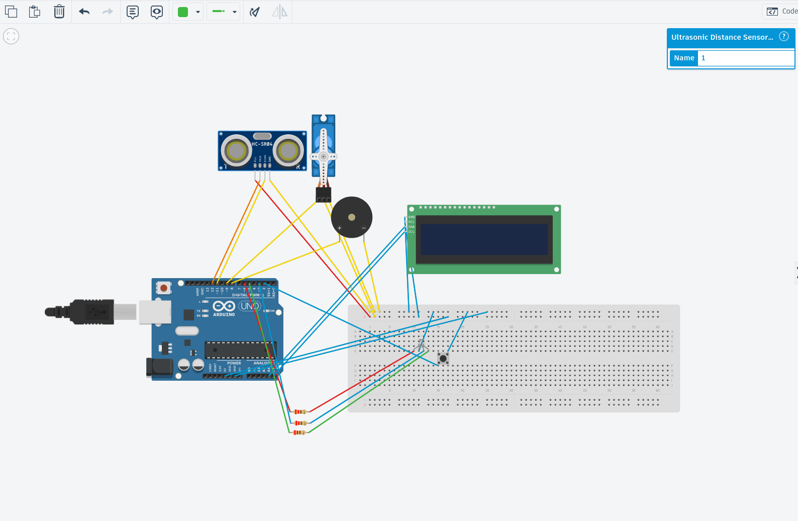
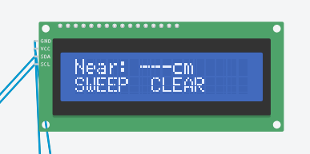
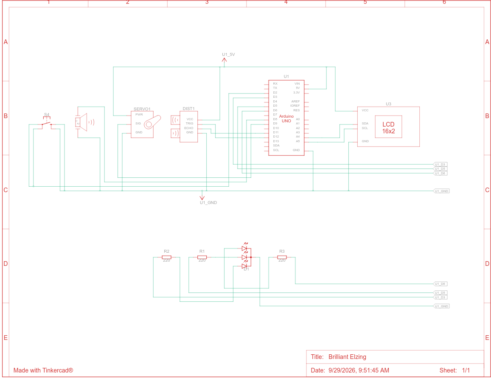

# Radar Parking Assist

Skenuojantis parkavimo pagalbininkas su Arduino Uno. Ultragarsinis jutiklis, sukamas servo variklio, apžiūri 150° sektorių ir įspėja apie kliūtis šviesa, garsu bei tekstu LCD ekrane.

Projektas sukurtas kaip robotikos kurso 1-asis namų darbas ir veikia [Tinkercad Circuits](https://www.tinkercad.com/circuits) virtualioje aplinkoje.



## Demonstracija

<!-- Įrašą įkelkite per Issues -> New issue (nutempkite docs/demo.mp4 į teksto lauką),
     tada gautą https://github.com/user-attachments/assets/... nuorodą įklijuokite čia
     atskiroje eilutėje. Arba įdėkite nuorodą į YouTube (Unlisted) įrašą. -->

Demonstracinis įrašas: [`docs/demo.mp4`](docs/demo.mp4)



---

## Turinys

- [Problema](#problema)
- [Kaip veikia](#kaip-veikia)
- [Komponentai](#komponentai)
- [Schema ir sujungimai](#schema-ir-sujungimai)
- [Paleidimas](#paleidimas)
- [Kodo struktūra](#kodo-struktūra)
- [Keičiami parametrai](#keičiami-parametrai)
- [Kas veikia ir kas ne](#kas-veikia-ir-kas-ne)
- [Tobulinimo kryptys](#tobulinimo-kryptys)
- [Repozitorijos struktūra](#repozitorijos-struktūra)

---

## Problema

Įprastas ultragarsinis jutiklis HC-SR04 „mato“ tik siaurą, maždaug 15° pločio kūgį tiesiai priešais save. Parkuojantis automobiliui to neužtenka: kliūtis, esanti prie buferio kampo, lieka nepastebėta.

Pramonėje ši problema sprendžiama dedant daug nejudančių jutiklių (tie apvalūs taškeliai automobilių buferiuose). Šiame darbe pasirinktas kitas kelias — **vienas jutiklis, sukamas servo variklio**, kaip veikia besisukantys LiDAR'ai ant savavaldžių automobilių. Taip vienu jutikliu padengiamas 150° sektorius ir papildomai sužinoma kliūties **kryptis**, o ne tik atstumas.

## Kaip veikia

Sistema turi du režimus, perjungiamus mygtuku.

**SWEEP (radaro režimas).** Servo suka jutiklį nuo 15° iki 165° penkių laipsnių žingsniais. Kiekviename žingsnyje matuojamas atstumas, o artimiausias radinys įsimenamas kartu su kampu. Pasiekus sektoriaus kraštą, sukimosi kryptis apsiverčia ir paskelbiamas viso pravažiavimo rezultatas. Vienas pilnas pravažiavimas trunka apie 1,8 s.

**PARK (fiksuotas režimas).** Servo sustoja 90° padėtyje ir žiūri tiesiai. Duomenys atnaujinami kas 60 ms, todėl reakcija daug greitesnė. Tinka paskutiniams centimetrams.

Kompromisas tarp režimų yra pagrindinė projekto idėja: **platus padengimas mainais į lėtesnę reakciją**.

### Įspėjimų zonos

| Būsena  | Atstumas    | LED spalva | Garsas                  |
|---------|-------------|------------|-------------------------|
| CLEAR   | nieko nerasta | Mėlyna   | Tyla                    |
| SAFE    | > 100 cm    | Žalia      | Tyla                    |
| CAUTION | 50–100 cm   | Geltona    | Lėti pyptelėjimai       |
| WARNING | 20–50 cm    | Oranžinė   | Dažnėja artėjant        |
| STOP!   | < 20 cm     | Raudona    | Greiti pyptelėjimai     |

WARNING zonoje intervalas tarp pyptelėjimų tiesiškai kinta nuo 450 ms iki 120 ms, todėl garsas intuityviai rodo, kiek dar liko vietos.

Potenciometras keičia zonų ribas 50–200 % ribose. Ekrane rodomas atstumas nesikeičia — koreguojamas tik jautrumas.

### LCD ekranas

```
Near: 45cm @120
SWEEP  WARNING
```

Viršutinė eilutė rodo artimiausią atstumą ir kampą, kuriuo jis rastas. Apatinėje — režimas ir būsena.

## Komponentai

| Kiekis | Komponentas                        | Paskirtis                          |
|--------|------------------------------------|------------------------------------|
| 1      | Arduino Uno R3                     | Valdiklis                          |
| 1      | Ultragarsinis jutiklis HC-SR04     | Atstumo matavimas                  |
| 1      | Micro servo (SG90 tipo)            | Jutiklio sukimas — **aktuatorius** |
| 1      | RGB šviesos diodas (bendras katodas) | Vizualinis įspėjimas             |
| 3      | Rezistorius 220 Ω                  | Srovės ribojimas LED               |
| 1      | Pjezo garsiakalbis                 | Garsinis įspėjimas                 |
| 1      | LCD 16×2 su I2C (PCF8574)          | Skaitmeninis atvaizdavimas         |
| 1      | Mygtukas                           | Režimo perjungimas                 |
| 1      | Potenciometras 250 kΩ *(nebūtinas)* | Jautrumo reguliavimas             |
| 1      | Maketavimo plokštė + laidai        | Sujungimai                         |

> Potenciometras yra papildoma galimybė. Jei jo grandinėje nėra, kode palikite `USE_POT = false` — tada naudojamas fiksuotas 100 % jautrumas. Su `true` ir neprijungtu A0 kontaktu rodmenys šokinėtų, nes „kabantis“ analoginis įėjimas grąžina atsitiktines reikšmes.

## Schema ir sujungimai



| Komponentas | Kontaktas | Arduino |
|-------------|-----------|---------|
| HC-SR04     | VCC / GND | 5V / GND |
| HC-SR04     | TRIG      | D12 |
| HC-SR04     | ECHO      | D11 |
| Servo       | Maitinimas / Masė | 5V / GND |
| Servo       | Signalas  | **D9** |
| Pjezo       | +         | D8 |
| Pjezo       | −         | GND |
| RGB LED     | Raudona → 220 Ω | D6 |
| RGB LED     | Žalia → 220 Ω   | D5 |
| RGB LED     | Mėlyna → 220 Ω  | D3 |
| RGB LED     | Katodas (ilga koja) | GND |
| Mygtukas    | Viena koja | D2 |
| Mygtukas    | Įstrižai priešinga koja | GND |
| Potenciometras *(nebūtinas)* | Kraštiniai kontaktai | 5V ir GND |
| Potenciometras *(nebūtinas)* | Vidurinis (šliaužiklis) | A0 |
| LCD I2C     | SDA / SCL | A4 / A5 |
| LCD I2C     | VCC / GND | 5V / GND |

### Kodėl būtent šie kontaktai

Spalvų maišymui reikia **PWM**, o Arduino Uno jį turi tik kontaktuose 3, 5, 6, 9, 10 ir 11. Du iš jų šiame projekte neveikia:

- `Servo` biblioteka naudoja laikmatį **Timer1**, todėl dingsta PWM kontaktuose **D9 ir D10**;
- `tone()` funkcija naudoja **Timer2**, todėl dingsta PWM kontaktuose **D3 ir D11**.

Lieka tik **D5 ir D6**, todėl jiems atiduotos raudona ir žalia spalvos — iš jų maišomi visi įspėjimų atspalviai (geltona = 255 raudonos + 150 žalios). Mėlyna prijungta prie D3 ir veikia tik įjungta/išjungta, nes naudojama vien būsenai „nieko nerasta“.

A4 ir A5 kontaktai LCD ekranui yra privalomi — tik juose Arduino Uno turi aparatinį I2C.

### Kodėl 220 Ω rezistoriai

Šviesos diodas pats neriboja srovės, todėl be rezistoriaus sudegtų jis arba Arduino kontaktas. Pagal Omo dėsnį:

- raudonam segmentui: (5 V − 2 V) / 220 Ω ≈ **13,6 mA**
- žaliam ir mėlynam: (5 V − 3 V) / 220 Ω ≈ **9 mA**

Abi reikšmės saugiai telpa po 20 mA riba. Kiekviena spalva turi savo rezistorių, nes jų įtampos krytis skiriasi — su vienu bendru rezistoriumi ryškumas priklausytų nuo to, kiek spalvų šviečia vienu metu.

## Paleidimas

1. Atidarykite [Tinkercad Circuits](https://www.tinkercad.com/circuits) ir sudėkite grandinę pagal aukščiau esančią lentelę.
2. Spustelėkite **Code**, perjunkite iš *Blocks* į **Text** ir įklijuokite [`src/radar_parking_assist/radar_parking_assist.ino`](src/radar_parking_assist/radar_parking_assist.ino) turinį.
3. Spustelėkite LCD elementą ir patikrinkite jo **Type** nustatymą:
   - `PCF8574` — kodo keisti nereikia;
   - `MCP23008` — pakeiskite `LCD_TYPE` reikšmę į `LCD_MCP23008`.
4. Paspauskite **Start Simulation**.
5. Spustelėkite ultragarsinį jutiklį ir tempkite atsiradusį kliūties apskritimą arčiau ar toliau.

Serial Monitor lange pirmoje eilutėje matysite rastą LCD adresą, toliau — `kampas,atstumas` poras. Jos tinka ir Serial Plotter grafikui.

> **Pastaba.** Kodas **neturi išorinių bibliotekų priklausomybių**, išskyrus standartines `Servo.h` ir `Wire.h`. LCD valdymas parašytas nuo nulio, nes Tinkercad aplinkoje `Adafruit_LiquidCrystal` biblioteka neprieinama.

## Kodo struktūra

| Blokas | Paskirtis |
|--------|-----------|
| `SimpleLcd` klasė | Nuosava I2C LCD tvarkyklė. Siunčia HD44780 komandas per PCF8574 plėstuvą 4 bitų režimu: kiekvienas baitas skaidomas į dvi puseles, `RS` bitas skiria komandą nuo raidės, `E` impulsas liepia ekranui nuskaityti duomenis. Adresas randamas automatiškai. |
| `readOnceCm()` | Vienas matavimas: 10 µs impulsas į TRIG, `pulseIn()` matuoja aido grįžimo laiką, atstumas = laikas / 58. |
| `readDistance()` | Triukšmo filtras — trijų matavimų **mediana**. |
| `setColor()` | RGB spalvos nustatymas per PWM. |
| `beepEvery()` | Neblokuojantis pyptelėjimas su intervalo kontrole. |
| `updateAlert()` | Pagal atstumą parenka zoną, spalvą ir garso dažnį. |
| `updateLcd()` | Suformuoja lygiai 16 simbolių eilutes per `snprintf()`. Atnaujinama kas 250 ms, kad ekranas nemirgėtų. |
| `handleButton()` | Mygtuko apdorojimas su 50 ms **debounce** — be jo vienas paspaudimas būtų užskaitytas kelis kartus. |
| `loop()` | Pagrindinis ciklas: matavimas, servo žingsnis, jautrumo perskaičiavimas, įspėjimai, ekranas. |

**Svarbiausias sprendimas:** `loop()` viduje nėra nė vieno `delay()`. Visas laikas skaičiuojamas per `millis()`, todėl servo sukimas, garsas, LED ir ekranas veikia lygiagrečiai ir netrukdo vieni kitiems. Su `delay()` pagrįstu kodu sistema tiesiog „užstrigtų“ kiekvieno pyptelėjimo metu.

## Keičiami parametrai

Visi nustatymai sudėti failo viršuje:

| Parametras | Reikšmė | Ką keičia |
|------------|---------|-----------|
| `DIST_SAFE`, `DIST_WARN`, `DIST_DANGER` | 100 / 50 / 20 cm | Zonų ribas |
| `SWEEP_MIN`, `SWEEP_MAX` | 15° / 165° | Skenuojamo sektoriaus plotį |
| `SWEEP_STEP` | 5° | Žingsnio dydį (mažesnis = tiksliau, bet lėčiau) |
| `STEP_MS` | 60 ms | Sukimosi greitį |
| `TONE_CAUTION`, `TONE_WARNING`, `TONE_STOP` | 440 / 523 / 659 Hz | Garso aukštį |
| `BEEP_MS` | 40 ms | Pyptelėjimo trukmę |
| `SOUND_ON` | `true` | `false` visiškai nutildo garsą |
| `USE_POT` | `false` | `true` įjungia potenciometro valdymą (jis turi būti prijungtas) |
| `FIXED_SENS` | 100 % | Jautrumas, kai potenciometro nėra |
| `LCD_TYPE` | `LCD_PCF8574` | I2C plėstuvo tipą |
| `LCD_ADDR` | `0` | `0` = ieškoti automatiškai, kitaip įrašyti adresą |

## Kas veikia ir kas ne

**Veikia:**

- atstumo matavimas su medianos filtru;
- servo skenavimas ir artimiausios kliūties kampo nustatymas;
- visos penkios įspėjimų zonos su spalvomis ir garsu;
- režimų perjungimas mygtuku be pakartotinių suveikimų;
- jautrumo reguliavimas potenciometru;
- LCD atvaizdavimas per nuosavą I2C tvarkyklę.

**Apribojimai:**

- **Tinkercad simuliacijoje kliūtis nejuda kartu su servo.** Realioje grandinėje jutiklis sukasi kartu su kliūties „matymo lauku“, o simuliatoriuje kliūties apskritimas lieka toje pačioje vietoje. Todėl demonstracijos metu kliūtį reikia tempti ranka, kol jutiklis sukasi.
- **SWEEP režimo reakcija lėta.** Kiekviena kryptis patikrinama tik kartą per ~1,8 s. Tai neišvengiama vieno sukamo jutiklio savybė.
- **Ultragarsas nemato minkštų ir įstrižų paviršių.** Garso banga nuo jų atsispindi į šoną ir negrįžta.
- **Pirminė LCD biblioteka neveikė.** Tinkercad aplinkoje `Adafruit_LiquidCrystal` neprieinama, todėl tvarkyklė parašyta nuo nulio remiantis HD44780 ir PCF8574 dokumentacija.
- **PWM kontaktų trūkumas.** Dėl `Servo` ir `tone()` užimtų laikmačių mėlynai spalvai PWM nebeliko, todėl ji valdoma tik įjungimo/išjungimo principu.
- **„Kabantis“ analoginis įėjimas.** Pašalinus potenciometrą, bet palikus `analogRead(A0)`, jautrumas ėmė šokinėti atsitiktinai. Išspręsta `USE_POT` jungikliu — tai geras pavyzdys, kodėl neprijungto analoginio kontakto skaityti negalima.

## Tobulinimo kryptys

- **Keli nejudantys jutikliai** vietoj vieno sukamo — taip veikia tikri automobilių parkavimo davikliai. Dingtų judančios dalys ir reakcijos vėlinimas.
- **Radaro vizualizacija.** Kodas jau siunčia `kampas,atstumas` poras per Serial. Processing arba Python programa galėtų piešti tikrą radaro ekraną.
- **Kalmano arba slenkamojo vidurkio filtras** vietoj medianos — tolygesni rodmenys.
- **Temperatūros kompensacija.** Garso greitis priklauso nuo oro temperatūros; TMP36 jutiklis leistų matuoti tiksliau.
- **Adaptyvus skenavimas.** Radus kliūtį, servo galėtų sulėtėti ir tikrinti tik tą sektorių, taip sutrumpindamas reakcijos laiką.
- **Duomenų kaupimas** visam sektoriui atmintyje, kad LCD galėtų rodyti kelias kliūtis vienu metu.

## Repozitorijos struktūra

```
radar-parking-assist/
├── src/
│   └── radar_parking_assist/
│       └── radar_parking_assist.ino   # Visas projekto kodas
├── docs/
│   ├── schema.png                      # Principinė schema (Tinkercad)
│   ├── grandine.png                    # Grandinė ant maketavimo plokštės
│   ├── lcd.png                         # LCD ekranas veikimo metu
│   └── demo.mp4                        # Demonstracinis įrašas
├── LICENSE
└── README.md
```

## Licencija

MIT — žr. [LICENSE](LICENSE).
